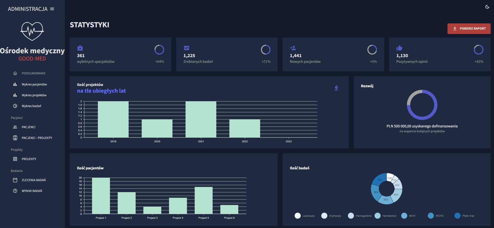
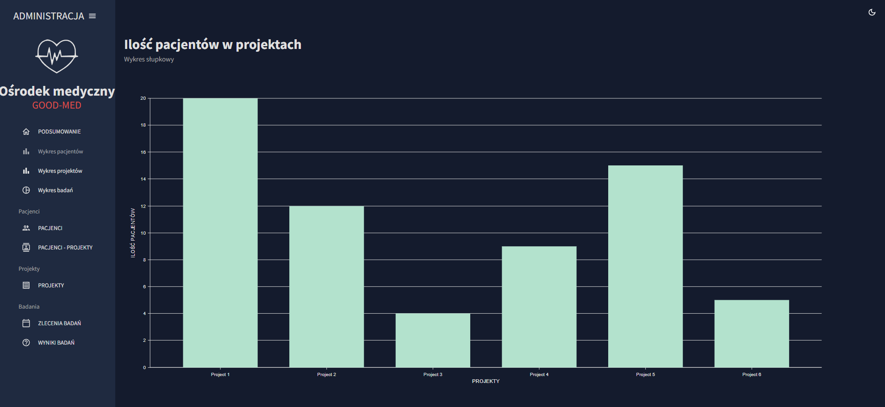
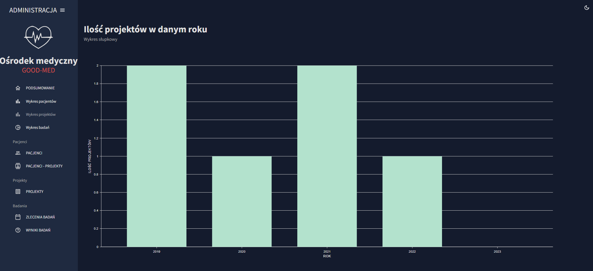
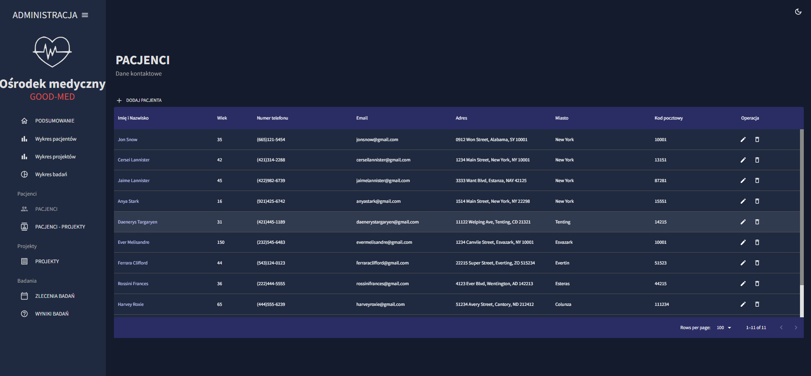
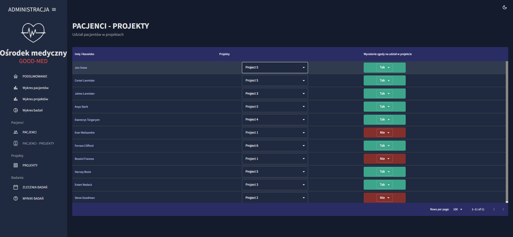
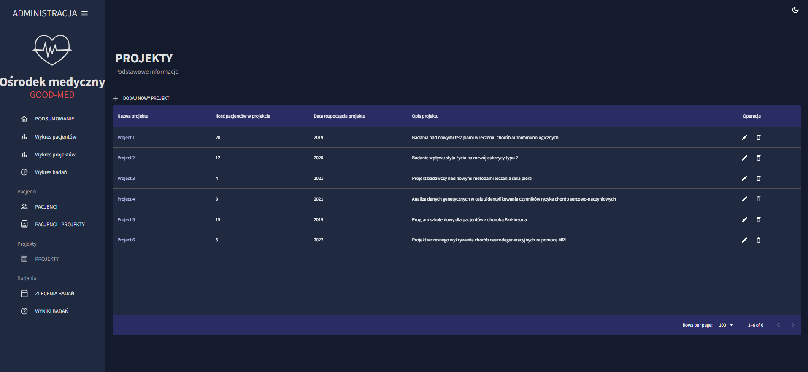
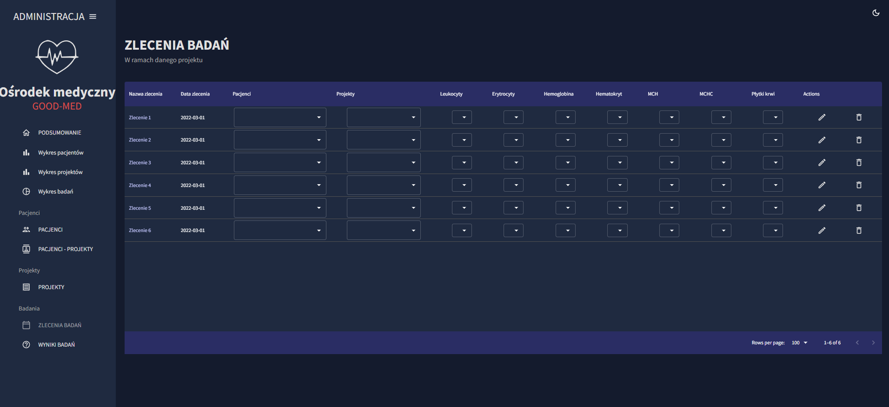

# medApp - application

An application for managing a medical center written using ReactJS with the use of MUI/Boostrap components.
I used the react-router-dom library for routing.

## How to run a project

#### git clone https://github.com/AnnaIdzkowska/med-app2.git

Then navigate to the med-admin folder in the terminal.

#### npm install
#### npm start

## Application view
#### - summary view

Dashboard view with statistics. Possibility to change the background to light using the icon.

Chart showing the number of patients in projects based on data from the mockData.js file.

Chart showing the number of projects in a given year based on data from the mockData.js file.

Chart showing the number of tests based on data from the mockData.js file.

#### - patient management view

Table with a list of patients and their data (pagination, sorting, searching by column). Possibility to add, delete, edit patients.

#### - view of adding patients to projects

Table with a list of patients (their data) related to the selected project and information whether consent has been granted (possibility to change the project and consent).

#### - project management view

Table with a list of projects and the number of patients in the project (pagination, sorting, searching by column). Possibility to add, delete, edit projects.

#### - view of test orders

Table with a list of orders and tests within a given order for a patient under a project (filtering by project and date). Ability to delete, edit orders.

#### - view of test results

Table with a list of tests. Possibility of adding, deleting, editing.

