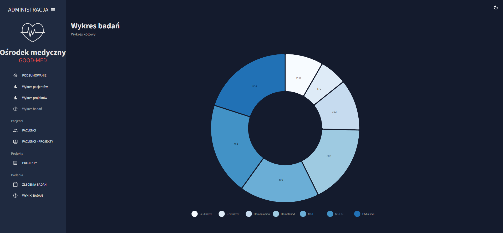

# medApp - application

An application for managing a medical center written using ReactJS with the use of MUI/Boostrap components

## How to run a project

In the project directory, you can run:

### git clone https://github.com/AnnaIdzkowska/med-app2.git

Then navigate to the med-admin folder in the terminal.

### npm install
### npm start

## Application view
#### summary view

#### patient management view

#### view of adding patients to projects

#### project management view

#### view of test orders

#### view of test results
