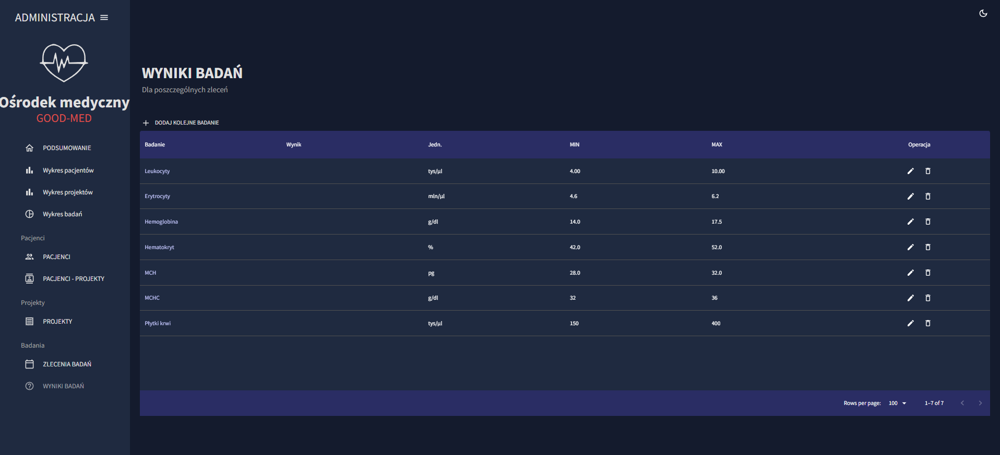

# medApp - application

An application for managing a medical center written using ReactJS with the use of MUI/Boostrap components

## How to run a project

In the project directory, you can run:

### git clone https://github.com/AnnaIdzkowska/med-app2.git

Then navigate to the med-admin folder in the terminal.

### npm install
### npm start

## Application view
#### summary view

#### patient management view

Table with a list of patients and their data (pagination, sorting, searching by column). Possibility to add, delete, edit patients.

#### view of adding patients to projects
table with a list of patients (their data) related to the selected project and information whether consent has been granted (possibility to change the project and consent).

#### project management view

Table with a list of projects and the number of patients in the project (pagination, sorting, searching by column). Possibility to add, delete, edit projects.

#### view of test orders

Table with a list of orders and tests within a given order for a patient under a project (filtering by project and date). Ability to add, delete, edit orders.

#### view of test results

Table with a list of tests. Possibility of adding, deleting, editing.
